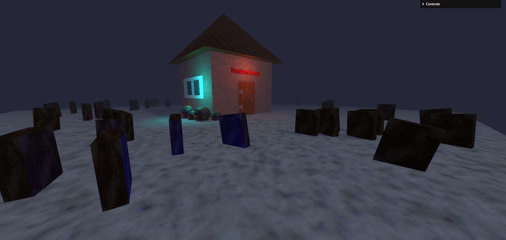

# HauntedHouseTJJ
Three.js Journey Lesson 16 'Haunted House'

## Application Deployed Link
https://hauntedhousetjj.netlify.app

## Screenshot



## Description

Three.js Haunted House scene created using Three.js geometries and textures.

'Ghosts' created by adding lights with random position animation.

Graves generate randomly within the floor area.

BONUS: Windows and 3d text added, some textures replaced.

## Installation

1. Copy this GitHub repository
2. Run ``` npm install ``` to install dependencies on your machine.
3. Run ``` npm run dev``` to see the application.


## Credits

### Course work

Bruno Simon at https://threejs-journey.com/

### 3d Textures 

Roof, window, floor, graves and rocks textures from https://3dtextures.me